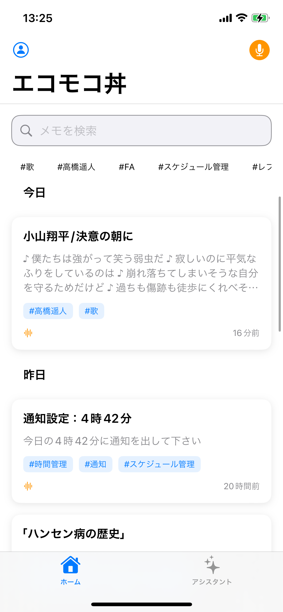

# EchoLog - AI-Powered Voice Memo App

音声メモをAIで賢く管理するフルスタックiOSアプリケーション


---

## 📱 UIデモ

<!-- スクリーンショットをここに追加 -->
<!-- 



-->

---

## 🎯 作品概要

EchoLogは、音声メモを録音するだけでなく、AI（OpenAI）が自動的に文字起こし、タグ付け、関連メモの提案を行う次世代のメモアプリです。従来のメモアプリとは異なり、ユーザーが意識することなくメモが整理され、必要な情報が自然に浮かび上がる体験を提供します。

### 主な機能

- 🎤 **ワンタップ録音**: シンプルなUIで即座に音声メモを作成
- 📝 **AI自動文字起こし**: Whisper APIによる高精度な音声認識
- 🏷️ **スマートタグ付け**: GPTがコンテキストを理解して自動タグ生成
- 🔗 **関連メモ発見**: 過去のメモとの関連性をAIが自動分析
- 🔔 **リマインダー自動抽出**: 「明日10時に会議」
- 🔐 **セキュア認証**: JWT + リフレッシュトークンによる永続化セッション
- 🔄 **自動同期**: クラウドとのシームレスな同期

---

## 💡 アピールポイント

### 1. **完全な非同期処理アーキテクチャ**
Swift Concurrency（async/await）とCombineを活用し、UIをブロックしないスムーズな体験を実現。バックエンドも非同期I/Oで高速レスポンス。

### 2. **トークン自動リフレッシュ機能**
401エラー時に自動的にリフレッシュトークンを使用してアクセストークンを更新。ユーザーに意識させない透明な認証UXを実現。

### 3. **MVVMアーキテクチャ + クリーンコード**
ViewModelとServiceレイヤーを明確に分離し、テスタビリティと保守性を両立。依存性注入パターンも採用。

### 4. **RESTful API設計**
標準的なHTTPメソッドとステータスコードを使用し、拡張性の高いAPI設計。Zodによる厳密なバリデーション。

### 5. **セキュリティファースト**
- Keychain による安全なトークン保存
- JWT + リフレッシュトークンの二重認証
- MongoDB Atlas の暗号化通信
- 環境変数による機密情報管理

---

## 🛠️ 工夫した点

### フロントエンド
1. **タグフィルタリングの最適化**: 選択中タグを先頭表示 + 使用頻度順ソート
2. **音声再生の状態管理**: AVAudioPlayerを使った細かい再生制御
3. **日付グルーピング**: 「今日」「昨日」「今週」などの直感的な分類
4. **ネットワーク監視**: オフライン時の適切なフォールバック処理
5. **デバイス対応**: Simulator/実機で自動的にAPIエンドポイント切り替え

### バックエンド
1. **OpenAI API統合**: Whisperによる文字起こし、GPTによるタイトル/タグ生成
2. **エラーハンドリング**: 統一されたエラーレスポンス形式
3. **ログ出力**: リクエスト/レスポンスの詳細ログで開発効率向上
4. **MongoDB インデックス**: created_at、tags、user_idに最適化インデックス
5. **CORS設定**: 開発環境と本番環境で柔軟に対応

---

## 🏗️ 技術スタック & アーキテクチャ

### Frontend (iOS App)
```
Swift 5.9+ / SwiftUI
├── アーキテクチャ: MVVM
├── 非同期処理: async/await, Combine
├── ネットワーク: URLSession
├── 音声処理: AVFoundation
├── 位置情報: CoreLocation
├── セキュリティ: Keychain Services
└── 対応OS: iOS 16.0+
```

### Backend (API Server)
```
Node.js 20.x / TypeScript 5.x
├── フレームワーク: Express.js
├── データベース: MongoDB Atlas
├── 認証: JWT + Refresh Token
├── バリデーション: Zod
├── AI統合: OpenAI API (Whisper, GPT-4)
└── 開発ツール: tsx (hot reload)
```

### ディレクトリ構成
```
EchoMemoApp/
├── frontend/               # iOS App (Swift/SwiftUI)
│   ├── Core/              # コアモジュール (Models, Services, Utilities)
│   ├── Features/          # 機能別モジュール (MVVM構造)
│   └── EchoLogApp/        # アプリエントリーポイント
│
└── backend/               # API Server (Node.js/TypeScript)
    ├── src/
    │   ├── controllers/   # ビジネスロジック
    │   ├── routes/        # エンドポイント定義
    │   ├── models/        # データモデル & バリデーション
    │   ├── middleware/    # 認証・エラーハンドリング
    │   ├── services/      # 外部API統合
    │   └── config/        # DB接続設定
    └── tsconfig.json
```

---

## 🚀 今後の拡張案

- [ ] **音声編集機能**: トリミング、結合、速度調整
- [ ] **オフラインモード**: CoreDataによるローカルストレージ + 同期キュー
- [ ] **キャッシュ**: swift ralm
- [ ] **リアルタイム文字起こし**: 録音中にライブで文字起こし表示
- [ ] **ウィジェット対応**: ホーム画面から即座に録音開始
- [ ] **音声検索**: 音声コマンドでメモを検索
- [ ] **AIアシスタント強化**: ナレッジグラフによるメモ間の関係性可視化
- [ ] **ジオフェンス通知**: 特定の場所で過去のメモを通知


---

## �� ライセンス

MIT License

---

## 👤 開発者

**Towa Yokoyama**
- GitHub: [@TowaYokoyama](https://github.com/TowaYokoyama)

---

**Built with ❤️ using Swift, SwiftUI, Node.js & AI**
