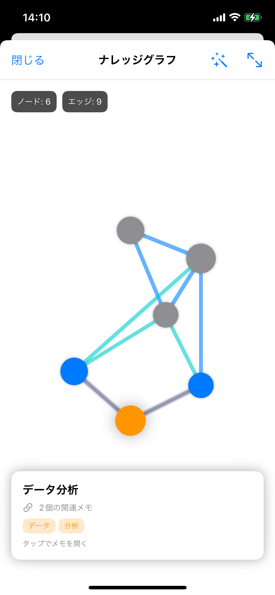

# 作品名：　エコモコ丼
# 作り始めた日：2025/11/07

音声メモをAIで賢く管理するフルスタックiOSアプリケーション


---

## 📱 UIデモ

<!-- スクリーンショットをここに追加 -->
<!-- 




-->

---

## 🎯 作品概要

**音声メモ × AI × ナレッジグラフ** で知識を可視化する次世代メモアプリ

EchoLogは、音声を録音するだけでAIが自動で文字起こし・タグ付け・関連メモ分析を行い、メモ間の繋がりをインタラクティブなグラフで可視化します。ユーザーは意識せずにメモが整理され、過去の知識が自然に浮かび上がる体験を得られます。

### コア機能フロー

🎤 **AI音声認識** → 📝 **自動整理** → 🕸️ **ナレッジグラフ** → 📤 **簡単共有**

- **Whisper API**: 高精度な音声文字起こし
- **GPT-4**: コンテキスト理解による自動タグ生成
- **Embedding分析**: メモ間の類似度計算（コサイン類似度 ≥ 0.75）
- **Force-Directed Layout**: 物理シミュレーションによるグラフ配置
- **LINE共有**: ワンタップでメモをシェア
- **JWT認証**: 自動トークンリフレッシュ

---

## 💡 技術的アピールポイント

### 🏗️ アーキテクチャ & 設計
- **MVVM + Clean Architecture**: ViewModelとServiceの明確な分離、テスタビリティ重視
- **Swift Concurrency**: async/awaitによる完全非同期処理、UIブロックなし
- **RESTful API**: Zodバリデーション + 統一エラーハンドリング

### 🔐 セキュリティ & 認証
- **JWT + Refresh Token**: 401エラー時の自動トークンリフレッシュ
- **Keychain**: 安全なトークン保存
- **MongoDB Atlas**: 暗号化通信、ネットワークアクセス制限

### 🎨 UX/UI & インタラクション
- **インタラクティブグラフ**: ピンチズーム・パン・ノード選択による探索的UI
- **自動レイアウト**: 画面サイズに応じた最適配置（GeometryReader活用）
- **リアルタイムフィルタ**: タグ・日付による動的絞り込み

### ⚡ パフォーマンス最適化
- **Canvas API**: 効率的なグラフ描画（100ノード・200エッジ対応）
- **MongoDB Index**: created_at, tags, user_idに最適化インデックス
- **バックグラウンド処理**: 類似度計算（O(n²)）の非同期実行

---

### 🕸️ ナレッジグラフ可視化

**データフロー:**
```
音声録音 → Whisper → GPT-4 → Embedding(1536次元) → コサイン類似度 → グラフ構築
```

**技術実装:**
- **Force-Directed Layout**: 反発力（全ノード間）+ 引力（エッジ接続ノード間）、50イテレーション
- **視覚化**: ノードサイズ30-60pt（接続数）、エッジ太さ2-6pt（類似度）、色分け（青→シアン→グレー）
- **インタラクション**: タップ選択 → ハイライト → 2回タップでメモ詳細、ピンチズーム・パン対応
- **パフォーマンス**: 約100ms、100ノード・200エッジ対応

### 📤 LINE共有機能
- **SwiftUI ShareLink**: ネイティブ共有シート統合
- **ShareService**: シングルトンパターンでフォーマット処理
- **URLスキーム**: Info.plistでLINEアプリ検出
- **フォーマット**: タイトル + 本文 + タグの整形出力

### 🛠️ その他の工夫
- **タグフィルタ**: 選択中タグ先頭 + 使用頻度順ソート
- **日付グルーピング**: 「今日」「昨日」「今週」の直感的分類
- **デバイス対応**: Simulator/実機で自動APIエンドポイント切り替え
- **OpenAI統合**: Whisper文字起こし + GPTタグ生成

---

## 🏗️ 技術スタック & アーキテクチャ

### Frontend (iOS App)
```
Swift 5.9+ / SwiftUI
├── アーキテクチャ: MVVM
├── 非同期処理: async/await, Combine
├── ネットワーク: URLSession
├── 音声処理: AVFoundation
├── 位置情報: CoreLocation
├── セキュリティ: Keychain Services
└── 対応OS: iOS 16.0+
```

### Backend (API Server)
```
Node.js 20.x / TypeScript 5.x
├── フレームワーク: Express.js
├── データベース: MongoDB Atlas
├── 認証: JWT + Refresh Token
├── バリデーション: Zod
├── AI統合: OpenAI API (Whisper, GPT-4)
├── 類似度計算: Cosine Similarity (Embedding-based)
├── リンク計算: 自動関連メモ検出（閾値0.75以上）
└── 開発ツール: tsx (hot reload)
```

### ディレクトリ構成
```
EchoMemoApp/
├── frontend/               # iOS App (Swift/SwiftUI)
│   ├── Core/              # コアモジュール (Models, Services, Utilities)
│   ├── Features/          # 機能別モジュール (MVVM構造)
│   └── EchoLogApp/        # アプリエントリーポイント
│
└── backend/               # API Server (Node.js/TypeScript)
    ├── src/
    │   ├── controllers/   # ビジネスロジック
    │   ├── routes/        # エンドポイント定義
    │   ├── models/        # データモデル & バリデーション
    │   ├── middleware/    # 認証・エラーハンドリング
    │   ├── services/      # 外部API統合
    │   └── config/        # DB接続設定
    └── tsconfig.json
```

---

### ナレッジグラフ可視化
- **Force-Directed Layout**: 物理シミュレーションによる自然なノード配置
- **類似度ベースの視覚化**: エッジの太さと色で関連性の強さを表現
- **インタラクティブ探索**: タップ、ズーム、パンでメモの繋がりを探索
- **デモモード**: ダミーデータで機能を即座に体験可能

### LINE共有機能
- **ネイティブ共有**: iOSのShareLinkを使った標準的な共有体験
- **フォーマット済みテキスト**: タイトル、本文、タグを整形して共有
- **LINE検出**: アプリの有無を自動判定
- **Info.plist統合**: URLスキームクエリの適切な設定

## 🚀 今後の拡張案

- [ ] **音声編集機能**: トリミング、結合、速度調整
- [ ] **オフラインモード**: CoreDataによるローカルストレージ + 同期キュー
- [ ] **キャッシュ**: Realm Swiftによる高速ローカルキャッシュ
- [ ] **リアルタイム文字起こし**: 録音中にライブで文字起こし表示
- [ ] **ウィジェット対応**: ホーム画面から即座に録音開始
- [ ] **音声検索**: 音声コマンドでメモを検索
- [ ] **グラフフィルタリング**: タグや日付でナレッジグラフをフィルタ
- [ ] **3Dグラフ表示**: SceneKitを使った立体的なナレッジグラフ
- [ ] **ジオフェンス通知**: 特定の場所で過去のメモを通知


---

## 🎨 実装の詳細

### ナレッジグラフ機能

**アルゴリズム:**
- Force-Directed Layout（力学ベース配置）
  - 反発力: 全ノード間で互いに離れる
  - 引力: エッジで繋がったノード間で引き寄せる
  - 50回のイテレーションで安定した配置を実現

**視覚化:**
- ノードサイズ: 接続数に応じて30-60pt
- エッジの太さ: 類似度0.75 → 2pt、1.0 → 6pt
- エッジの色:
  - 🔵 青（類似度 > 0.85）: 強い関連性
  - 🔷 シアン（類似度 > 0.80）: 中程度の関連性
  - ⚪ グレー（類似度 ≤ 0.80）: 弱い関連性

**技術スタック:**
- SwiftUI Canvas API（効率的な描画）
- GeometryReader（レスポンシブレイアウト）
- Gesture Recognizers（ピンチ・パン操作）

### LINE共有機能

**実装方法:**
- ShareService: シングルトンパターンでシェア機能を提供
- ShareLink: SwiftUI標準コンポーネント
- Info.plist: LSApplicationQueriesSchemes設定

**共有フォーマット:**
```
タイトル: [メモタイトル]

[メモ本文]

タグ: [タグ1], [タグ2], ...
```

---

## 📊 データフロー

### メモ作成から関連性分析まで

```
1. 音声録音
   ↓
2. Whisper API → 文字起こし
   ↓
3. GPT-4 → タイトル・タグ生成
   ↓
4. OpenAI Embedding → ベクトル化（1536次元）
   ↓
5. MongoDB保存
   ↓
6. linkCalculator → コサイン類似度計算
   ↓
7. related_memo_ids更新（類似度 ≥ 0.75）
   ↓
8. ナレッジグラフ表示
```

---

## 📈 パフォーマンス

- **グラフ描画**: 100ノード・200エッジまで快適に動作
- **レイアウト計算**: 50イテレーション、約100ms
- **類似度計算**: O(n²)、バックグラウンド処理
- **メモ取得**: MongoDB インデックス活用で高速クエリ

---

## 📝 開発メモ

### 技術的な挑戦

1. **Force-Directed Layout**: 物理シミュレーションの調整が難しい
   - 反発力と引力のバランス調整
   - イテレーション回数の最適化
   - 画面サイズへの自動フィット

2. **Canvas描画**: SwiftUIでの低レベル描画
   - エッジとノードの重なり順制御
   - ジェスチャーとの統合
   - パフォーマンス最適化

3. **類似度計算**: Embeddingベースの関連性検出
   - 閾値の調整（0.75が最適）
   - 双方向リンクの管理
   - 削除時のクリーンアップ
---

## 👤 開発者

**Towa Yokoyama**
- GitHub: [@TowaYokoyama](https://github.com/TowaYokoyama)

---

**Built with ❤️ using Swift, SwiftUI, Node.js & AI**
